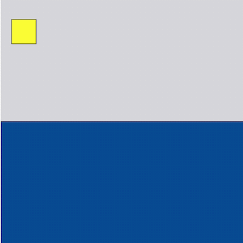

# Homework Day 2

- [Exercise 1](#exercise-1)
- [Exercise 2](#exercise-2)
- [Exercise 3](#exercise-3)
- [Exercise 4](#exercise-4)

## Exercise 1
### The Greatest

### 1.1
Ask the user for two numbers, return the greater one.

### 1.2
Ask the user for three numbers. Return the greatest.

## Exercise 2
### Beachwalk Hotel 🏖 <br />
Let's calculate how much a hotel stay costs at the fantastic Beachwalk Hotel

### 2.1
The price for night is `90€`<br />
Ask the user for how many nights he would like to stay and print the total cost.

### 2.2
Breakfast is an extra `10€`<br />
Continue from the last exercise and ask the user if he would like to include breakfast.<br />
Print the total cost.

#### Hints
1. Gur qrpvfvba fubhyq raq hc va n obbyrna inevnoyr, fhpu gung lbh pna hfr vg va na vs fgngrzrag.
1. (guvf vf arj vasbezngvba!) Lbh pbhyq hfr n pbzcnevfba bcrengbe pnyyrq `==` juvpu nyfb jbexf sbe fgevatf.
2. Sbe rknzcyr `yrg nafjre = "lrf"; nafjre=="lrf"`
3. (ynml nccebnpu) lbh pna nyfb hfr n ernqyvar-flap zrgubq pnyyrq `xrlVaLA`


### 2.3
Discount<br />
Let's discount guests who stay for longer periods.<br />
Continue from the last exercise and calculate a discount.<br />
> 5 nights or more, 10%<br />
> 10 nights or more, 15%<br />
> 15 nights or more, 20%<br />
```
Only the room is affected by the discount. Breakfast price stays the same.
```

#### Hints
1. Fgneg jvgu n inevnoyr pnyyrq `qvfpbhag_creprag` naq frg vg gb 0 sbe gur onfr fpranevb bs yrff guna 5 qnlf.
2. Tenqhnyyl hcqngr gur `qvfpbhag_creprag` jvgu qvssrerag vs fgngrzragf.

### 2.4
Extra guest <br />
Continue from the last exercise.<br />
Ask the user how many guests will stay in the room (1 or 2)<br />
> Add 10€ per night for an extra guest (Before discount)
```
Don't forget the extra breakfast 🥐
```


## Exercise 3
### Currency converter V2
Take the program from today, that asks the user for an amount in USD and prints out the value in EURO.<br />
Use the rate 1 USD = 0.910463 EUR. Extend the converter to use a precision of 2 decimal points in the output.<br />
For example the output for 100 USD should be 94.04 EUR (the bank will cut the extra 0.0063 EUR and make profit from that).

#### Hints

1. Guvf vf n irel pbzzba fpranevb jurer lbh jvyy svaq ybgf bs qvssrerag zrgubqf bayvar. Punyyratr zvtug or gb svaq gur "orfg" bar.
2. (guvf vf tvivat njnl n fbyhgvba) Hfr n zrgubq pnyyrq `gbSvkrq`: Sbe rknzcyr `yrg ahzore = 0.1234; pbafbyr.ybt(ahzore.gbSvkrq(2));`.

## Exercise 4
### Format text
Choose a simple Ascii art from the website https://www.asciiart.eu/.<br />
Output it to the ___console___.
```
        _______
       //  ||\ \
 _____//___||_\ \___
 )  _          _    \
 |_/ \________/ \___|
___\_/________\_/______
```

#### Hints

1. Jung unccraf vs lbh nqq fcnprf gb lbhe fgevat gb cevag, fhpu nf `pbafbyr.ybt("   fcnprq      bhg     ")`
2. Jvgu lbhe xabjyrqtr vg'f rnfvrfg gb fbyir guvf rkrepvfr ol pnyyvat pbafbyr.ybt zhygvcyr gvzrf.
3. Vg'f cbffvoyr gb qb vg va bar yvar bs pbqr (ohg gevpxl gb trg gur nyvtazrag evtug) ol hfvat fbzrguvat pnyyrq n arjyvar punenpgre.
4. *Alternative* solution that requires extra knowledge: Qb fbzr erfrnepu nobhg Grzcyngr Yvgrenyf va WninFpevcg.

## Exercise 4
### Conditions and variables in p5js
Go back to https://editor.p5js.org/

Starting with this template (you can also find it online [here](https://editor.p5js.org/zormit/sketches/PhF3MNH81)):
```JavaScript
function setup() {
  createCanvas(400, 400);
}

function draw() {
  background(220);
  fill(7, 85, 153);
  rectMode(CORNER);
  rect(0, width / 2, width, height);

  fill(255);

  rectMode(CENTER);
  rect(mouseX, mouseY, 40);
}
```

* Make the rectangle turn into a circle when it's below the "water".
* Make the fill go from white to yellow dependent on the horizontal (left-right) movement

#### Demonstration


